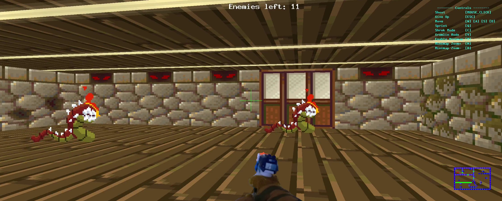

# Cub3D - École 42

<a href="https://www.cprogramming.com/" target="_blank" rel="noreferrer"></a>

Ce projet en **C** est inspiré du jeu [Wolfenstein 3D](http://users.atw.hu/wolf3d/) , considéré comme le premier FPS
jamais développé. Il vous permettra d’explorer la technique du ray-casting. Votre objectif
est de faire une vue dynamique au sein d’un labyrinthe, dans lequel vous devrez trouver
votre chemin.



## Status:

Projet de groupe réalisé avec VGiraudo

Validé le 25/07/2023

Note: 125% ✅

## Présentation

Dans ce projet, vous créerez dans le **langage C**, un simulateur de labyrinthe 3D en utilisant les techniques de raycasting, qui sont couramment utilisées pour générer des mondes 3D dans les jeux vidéo. Vous serez en mesure de charger des cartes de labyrinthes à partir de fichiers, vous déplacer à l'intérieur de ces cartes et interagir avec l'environnement.

## Installation

```bash
git clone https://github.com/fleuryD/42-cub3d.git
cd 42-cub3d
make
```

## Utilisation

Lancez le jeu en exécutant une des commandes suivantes:

```bash
./cub3d ./maps/01.cub
./cub3d ./maps/02.cub
./cub3d ./maps/03.cub
./cub3d ./maps/04.cub
```
